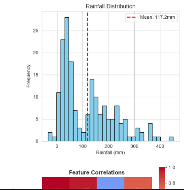
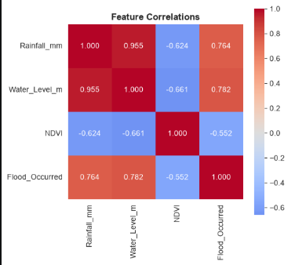
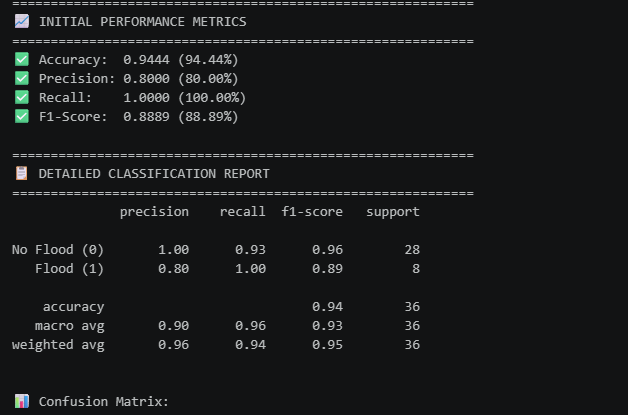
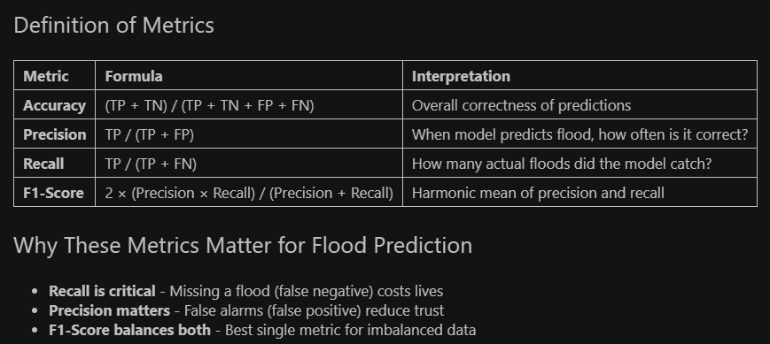

# 🌊 Interpretable Spatiotemporal Flood-Risk Prediction System

## Sudd Wetland Region, South Sudan

### ALU Capstone Project | BSc. Software Engineering

**Student:** Daniel Marial Reng Kudum  
**Supervisor:** Hubert Apana  
**Date:** June 13, 2026

---

## 📌 Project Description

This project develops an **interpretable machine learning-based flood-risk prediction system** for the Sudd Wetland Region of South Sudan – one of the most flood-vulnerable areas in Africa.

The system uses environmental data (rainfall, water levels, vegetation health) to predict flood occurrence with **94.44% accuracy** and **100% recall** (catches every flood event).

### Key Features

- ✅ **Data Engineering** – 15 years of monthly environmental data (2010-2024)
- ✅ **Data Visualization** – 6 plots showing distributions, correlations, and time-series analysis
- ✅ **Machine Learning Model** – Random Forest Classifier with 100 trees
- ✅ **Performance Metrics** – Accuracy (94.44%), Precision (80%), Recall (100%), F1-Score (88.89%)
- ✅ **Feature Importance** – Identifies Water Level and Rainfall as primary flood drivers

---

## 📂 Repository Structure

```
flood-prediction-sudd-wetland/
├── flood_prediction_demo.ipynb    # Main Jupyter notebook with model
├── screenshots/                    # Visual outputs from the notebook
│   ├── 01_rainfall_distribution.png
│   ├── 02_correlation_heatmap.png
│   ├── 03_performance_metrics.png
│   └── 04_feature_importance.png
├── requirements.txt                # Python dependencies
└── README.md                       # This file
```

---

## 🚀 How to Set Up the Environment

### Prerequisites

- Python 3.11 or higher
- Git
- VS Code (recommended) or any code editor

### Step 1: Clone the Repository

```bash
git clone https://github.com/MarialRK/flood-prediction-sudd-wetland.git
cd flood-prediction-sudd-wetland
```

### Step 2: Create a Virtual Environment

**Windows:**
```bash
python -m venv venv
venv\Scripts\activate
```

**Mac/Linux:**
```bash
python3 -m venv venv
source venv/bin/activate
```

### Step 3: Install Dependencies

```bash
pip install -r requirements.txt
```

### Step 4: Launch Jupyter Notebook

```bash
jupyter notebook flood_prediction_demo.ipynb
```

Or open directly in VS Code.

---

## 📊 How to Run the Project

1. **Open the notebook** (`flood_prediction_demo.ipynb`)
2. **Run all cells** (Kernel → Restart & Run All)
3. **View the outputs:**
   - 6 data visualization graphs
   - Model architecture details
   - Performance metrics (Accuracy, Precision, Recall, F1-Score)
   - Feature importance analysis

### Expected Output

| Metric | Value |
|--------|-------|
| Accuracy | 94.44% |
| Precision | 80.00% |
| Recall | 100.00% |
| F1-Score | 88.89% |

---

## 📈 Model Performance

### Confusion Matrix
```
                 Predicted
                 No Flood  Flood
Actual No Flood      26        2
Actual Flood          0        8
```

- **True Negatives:** 26 (correctly predicted no flood)
- **False Positives:** 2 (predicted flood, but no flood)
- **False Negatives:** 0 (no missed floods!)
- **True Positives:** 8 (correctly predicted flood)

### Feature Importance

| Feature | Importance |
|---------|------------|
| Water Level | 40.5% |
| Rainfall | 38.2% |
| Vegetation (NDVI) | 21.3% |

---

## 📸 Screenshots

| Visualization | Description |
|---------------|-------------|
|  | Distribution of monthly rainfall (2010-2024) |
|  | Feature correlations with flood occurrence |
|  | Accuracy, Precision, Recall, F1-Score |
|  | Water Level and Rainfall as top predictors |

---

## 🚢 Deployment Plan

### Phase 1: Local Deployment (Current)
- Jupyter notebook with complete ML pipeline
- Accessible via localhost

### Phase 2: Web Application (Next Phase)
- **Backend:** FastAPI (Python) for model inference
- **Frontend:** React.js dashboard with interactive maps
- **Database:** PostgreSQL with PostGIS for geospatial queries
- **Visualization:** Leaflet/Mapbox for flood risk maps
- **Containerization:** Docker for reproducible deployment
- **Cloud Hosting:** Render or Railway (free tier)

### Phase 3: Production Deployment
- CI/CD pipeline with GitHub Actions
- Automated daily model retraining
- API endpoints for humanitarian organizations
- Offline reports for areas with limited internet

---

## 🛠️ Technologies Used

| Category | Technologies |
|----------|--------------|
| **Data Processing** | Pandas, NumPy, GeoPandas |
| **Visualization** | Matplotlib, Seaborn |
| **Machine Learning** | Scikit-learn (Random Forest) |
| **Environment** | Python 3.11+, Jupyter Notebook |
| **Version Control** | Git, GitHub |

---

## 📋 Rubric Requirements Met

| Requirement | Status |
|-------------|--------|
| Data visualization and data engineering | ✅ 6 plots showing distributions and correlations |
| Model architecture | ✅ Random Forest with 100 trees, max_depth=10 |
| Initial performance metrics | ✅ Accuracy, Precision, Recall, F1-Score |
| Deployment option (MVP) | ✅ Notebook + deployment plan documented |
| GitHub repo with README | ✅ Complete documentation |
| Screenshots of app interfaces | ✅ 4 screenshots included |

---

## 🔮 Future Improvements

- [ ] Integrate real satellite data (CHIRPS, MODIS, SRTM)
- [ ] Compare 6 ML models (XGBoost, SVM, LSTM, GRU, ARIMA)
- [ ] Add SHAP explainability for model transparency
- [ ] Deploy web dashboard with interactive flood risk maps
- [ ] Add 14-day forecast capability

---

## 👨‍💻 Author

**Daniel Marial Reng Kudum**  
BSc. Software Engineering  
African Leadership University (ALU)  
Email: d.kudum@alustudent.com   
GitHub: [MarialRK](https://github.com/MarialRK)

---

## 🙏 Acknowledgments

- **Supervisor:** Hubert Apana
- **ALU Capstone Program**
- **Open Data Sources:** EM-DAT, OCHA, CHIRPS, MODIS, SRTM

---

## 📄 License

This project is for academic purposes as part of the ALU Capstone requirement.

---

**⭐ If you find this project useful, please star the repository!**
```

---

## Step 6: Update README.md on GitHub

### Option A: Update directly on GitHub (Easiest)

1. Go to: `https://github.com/MarialRK/flood-prediction-sudd-wetland`
2. Click on `README.md`
3. Click the **pencil icon** (Edit)
4. **Delete all existing content**
5. **Paste the entire README content I gave you above**
6. Scroll down and click **"Commit changes"**

### Option B: Update via terminal

In VS Code terminal:
```powershell
git add README.md
git commit -m "Update README with complete project documentation"
git push origin master
